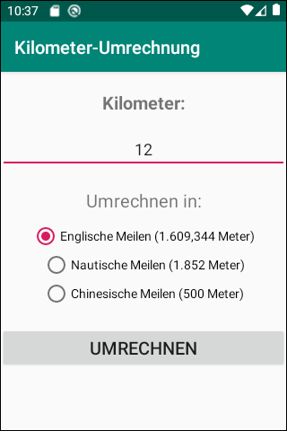
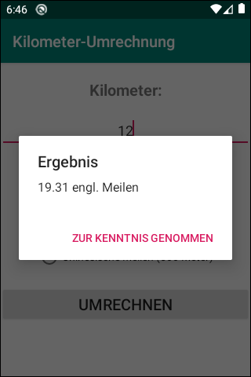

# Android-App "Kilometer-Umrechnung" #

 

Dieses Repository enthält ein Android-Studio-Projekt für eine einfache native Android-App, die Kilometer in englische Meilen, nautische Meilen oder chinesische Meilen umrechnen kann.  
Der Zweck der App ist es, verschiedene Ansätze für automatisches Testen zu demonstrieren, nämlich:
* Unit-Tests mit [JUnit4](https://junit.org/junit4/), siehe Klasse [KilometerUmrechnerTest.java](app/src/test/java/de/mide/kilometer_umrechnung/KilometerUmrechnerTest.java)  
* UI-Tests mit [Espresso](https://developer.android.com/training/testing/espresso/), siehe Klasse [MainActivityInstrumentedTest.java](app/src/androidTest/java/de/mide/kilometer_umrechnung/MainActivityInstrumentedTest.java)  

 

Es gibt auch eine Variante dieser App als Hybrid-App mit [Ionic](https://ionicframework.com), siehe [dieses Repository](https://github.com/MDecker-MobileComputing/Ionic_KilometerUmrechnung).

 

----

## Screenshot ##

 

 &nbsp;  

 

----

## License ##

 

See the [LICENSE file](LICENSE.md) for license rights and limitations (BSD 3-Clause License).

 
